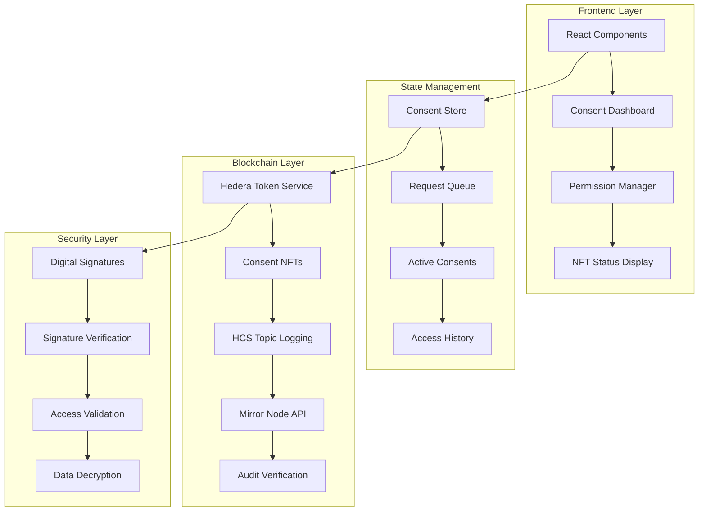
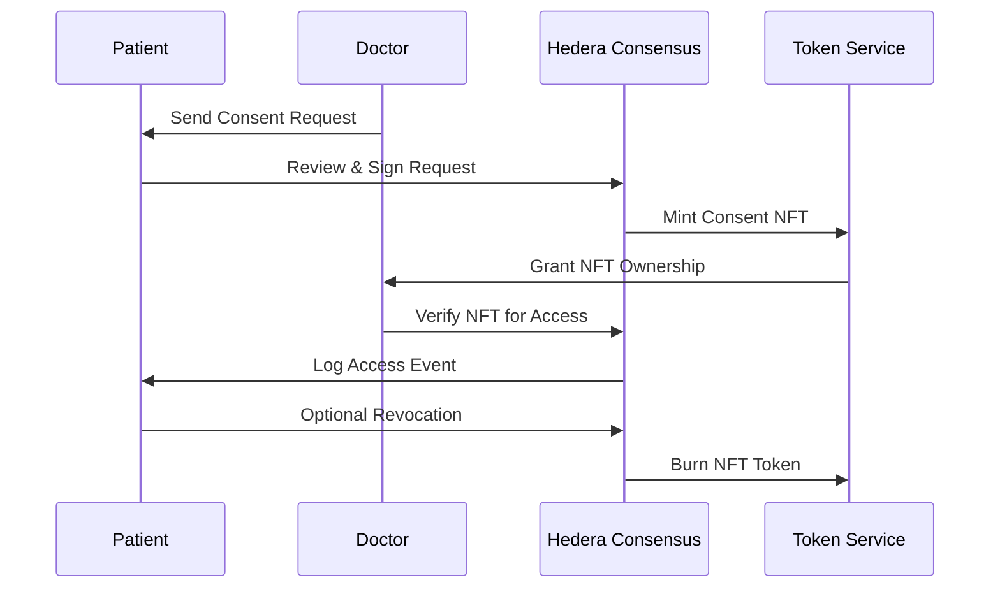

# 🛡️ MediLedger Nexus NFT-Based Consent System

<div align="center">

**Production-Ready Healthcare Consent Management with Blockchain Security**

[](https://hedera.com/)
[](https://hedera.com/)
[](https://hedera.com/)
[](https://www.typescriptlang.org/)

**Secure • Transparent • Patient-Controlled**

</div>

---

## 📋 **Overview**

The MediLedger Nexus Consent System implements **production-ready NFT-based medical record consent** using Hedera Hashgraph for secure, traceable access control. This system revolutionizes healthcare data sharing by giving patients complete control over their medical information while providing healthcare providers with secure, verifiable access permissions.

### **🎯 Core Principles**
- **🔐 Patient Sovereignty**: Patients own and control their medical data
- **⚡ Instant Access Control**: NFT-based permissions for immediate access management
- **📜 Immutable Audit Trails**: Every consent action logged on Hedera Consensus Service
- **🚨 Emergency Override**: Critical access protocols for life-threatening situations

---

## 🏗️ **System Architecture**



### **🔄 Consent Lifecycle**



---

## 🚀 **Quick Start Guide**

### **Prerequisites**
- **Node.js** 18.0+ and npm
- **HashPack Wallet** with testnet account
- **Hedera Testnet** account and keys
- **HCS Topic** for audit logging

### **1. Environment Configuration**

Create your `.env.local` file:

```bash
# HashConnect Configuration
NEXT_PUBLIC_HASHCONNECT_PROJECT_ID=your-reown-project-id
NEXT_PUBLIC_HEDERA_NETWORK=testnet

# Your Testnet Account (from HashPack)
HEDERA_ACCOUNT_ID=0.0.7123249
HEDERA_PRIVATE_KEY=your-private-key-here

# HCS Topic for Logging
HCS_TOPIC_ID=0.0.12345
NEXT_PUBLIC_HCS_TOPIC_ID=0.0.12345

# Features
NEXT_PUBLIC_ENABLE_HCS=true
NEXT_PUBLIC_HEDERA_NETWORK=testnet
```

### **2. Install Dependencies**
```bash
npm install
# or
yarn install
```

### **3. Start Development Server**
```bash
npm run dev
# or
yarn dev
```

### **4. Access Consent Management**
- **Patient Dashboard**: `http://localhost:3000/dashboard`
- **Doctor Dashboard**: `http://localhost:3000/doctor-dashboard`
- **Consent Management**: Navigate to the "Consent" tab in respective dashboards

---

## 💡 **How It Works**

### **🔄 Patient Journey**

1. **📥 Receive Request**: Patient receives consent request from healthcare provider
2. **🔍 Review Terms**: Review requested permissions, purpose, and duration
3. **✅ Grant Consent**: Sign transaction and mint NFT to doctor's wallet
4. **🔄 Manage Access**: View active consents and revoke when needed
5. **📊 Audit History**: Track all access events with full transparency

### **👨‍⚕️ Doctor Journey**

1. **📤 Send Request**: Submit consent request with specific data requirements
2. **⏳ Await Approval**: Wait for patient to review and approve request
3. **🔑 Verify Access**: Confirm NFT ownership before accessing patient data
4. **📋 Manage Patients**: View all patients with active consent permissions
5. **🚨 Emergency Access**: Request immediate access for critical situations

### **🔗 Integration Flow**

```typescript
// 1. Doctor requests consent
const request = await createConsentRequest(
  doctorDid,
  patientDid,
  ['read', 'analyze'], // permissions
  30, // days
  'Medical consultation'
);

// 2. Patient reviews and approves
const consent = await grantConsent(
  requestId,
  patientSignature
);

// 3. NFT minted and transferred
// NFT automatically minted to doctor's wallet

// 4. Doctor verifies access
const isValid = await verifyConsentForAccess(
  consentId,
  doctorAccountId
);

// 5. Access granted with audit logging
// All access logged to HCS for transparency
```

---

## 🛡️ **Security Features**

### **🔐 Multi-Layer Protection**

| Layer | Technology | Purpose |
|-------|------------|---------|
| **Authentication** | HashConnect + Digital Signatures | Wallet-based identity verification |
| **Authorization** | NFT Ownership | Token-based access permissions |
| **Encryption** | AES-256 + RSA-2048 | Data protection at rest and in transit |
| **Audit** | Hedera Consensus Service | Immutable access logs |
| **Validation** | zk-SNARKs | Zero-knowledge proof verification |

### **🚨 Emergency Access Protocol**

**Break-Glass Procedure:**
1. **Automated Assessment**: AI evaluates emergency severity
2. **Instant Override**: Temporary access without patient consent
3. **Time-Limited**: Access expires after emergency resolution
4. **Full Audit**: Complete log of emergency access activities
5. **Patient Notification**: Immediate alerts to patient and contacts

### **⚖️ Compliance & Standards**

- **HIPAA Compliant**: Healthcare data protection standards
- **GDPR Ready**: European privacy regulations
- **HL7 FHIR**: Healthcare interoperability protocols
- **HCS-10**: AI agent communication standards
- **ISO 27001**: Information security management

---

## 📚 **API Reference**

### **Consent Management Endpoints**

#### **Create Consent Request**
```typescript
POST /api/consent/request

{
  "doctorDid": "did:hedera:testnet:0.0.123456",
  "patientDid": "did:hedera:testnet:0.0.789012",
  "permissions": ["read", "write", "analyze"],
  "dataTypes": ["lab_results", "imaging", "medications"],
  "purpose": "Comprehensive medical consultation",
  "expiryDays": 30,
  "emergencyAccess": true
}
```

#### **Grant Consent**
```typescript
POST /api/consent/grant

{
  "requestId": "consent-req-12345",
  "patientSignature": "base64-encoded-signature",
  "consentMetadata": {
    "conditions": ["standard_care", "emergency_only"],
    "restrictions": ["no_third_party_sharing"]
  }
}
```

#### **Verify Access**
```typescript
GET /api/consent/verify/{consentId}

Response:
{
  "valid": true,
  "permissions": ["read", "analyze"],
  "expiresAt": "2024-02-15T10:30:00Z",
  "nftTokenId": "0.0.12345",
  "nftSerialNumber": "1"
}
```

#### **Revoke Consent**
```typescript
DELETE /api/consent/{consentId}

{
  "patientSignature": "base64-encoded-signature",
  "reason": "Patient request"
}
```

---

## 🧪 **Testing & Development**

### **Test Scenarios**

#### **✅ Happy Path Testing**
```bash
# 1. Complete patient registration
# 2. Complete doctor registration
# 3. Doctor sends consent request
# 4. Patient approves request
# 5. Verify NFT minted to doctor
# 6. Doctor accesses patient data
# 7. Patient revokes consent
# 8. Verify NFT burned and access denied
```

#### **🚨 Edge Case Testing**
- **Expired Consents**: Automatic access denial after expiry
- **Emergency Access**: Override protocols for critical situations
- **Network Issues**: Graceful degradation with local fallbacks
- **Signature Validation**: Proper cryptographic verification

### **Development Commands**
```bash
# Run consent-specific tests
npm test -- --grep "consent"

# Run blockchain integration tests
npm test -- --grep "hedera"

# View test coverage
npm run test:coverage

# Debug with verbose logging
DEBUG=consent:* npm run dev
```

---

## 🔧 **Configuration Options**

### **Network Settings**
```bash
# Development (free transactions)
NEXT_PUBLIC_HEDERA_NETWORK=testnet
HEDERA_ACCOUNT_ID=0.0.7123249

# Production (requires HBAR)
NEXT_PUBLIC_HEDERA_NETWORK=mainnet
HEDERA_ACCOUNT_ID=0.0.123456
```

### **Feature Flags**
```bash
# Enable blockchain features
NEXT_PUBLIC_ENABLE_HCS=true
NEXT_PUBLIC_ENABLE_NFTS=true

# Development fallbacks
NEXT_PUBLIC_MOCK_CONSENTS=false
NEXT_PUBLIC_DEMO_MODE=false
```

### **Security Settings**
```bash
# Signature requirements
REQUIRE_PATIENT_SIGNATURE=true
REQUIRE_DOCTOR_SIGNATURE=true

# Emergency access
EMERGENCY_ACCESS_TIMEOUT=24  # hours
EMERGENCY_NOTIFICATION=true
```

---

## 🚨 **Emergency Access Protocol**

### **🔥 Critical Situation Handling**

**Automatic Triggers:**
- **Trauma Codes**: Automatic emergency access for trauma patients
- **Cardiac Events**: Immediate access for heart-related emergencies
- **Stroke Protocols**: Fast-track access for neurological emergencies
- **Allergic Reactions**: Immediate access for severe allergy cases

**Manual Override:**
```typescript
// Emergency access request
const emergencyAccess = await grantEmergencyAccess(
  doctorDid,
  patientDid,
  "Critical cardiac emergency - immediate intervention required",
  48 // hours access
);

// Verify emergency status
const isEmergencyActive = await checkEmergencyStatus(patientDid);
```

### **📱 Real-Time Notifications**

**Multi-Channel Alerts:**
- **SMS Notifications**: Immediate text alerts to emergency contacts
- **Email Updates**: Detailed access logs and status updates
- **Push Notifications**: Mobile app alerts for healthcare providers
- **HCS Logging**: Immutable blockchain audit of emergency access

---

## 📊 **Analytics & Monitoring**

### **📈 Usage Metrics**

**Consent Analytics:**
- **Request Approval Rate**: Percentage of requests granted vs denied
- **Average Response Time**: Time from request to decision
- **Access Frequency**: How often consents are used for data access
- **Emergency Usage**: Frequency and justification of emergency access

**Security Metrics:**
- **Failed Access Attempts**: Unauthorized access attempts blocked
- **Audit Compliance**: Percentage of actions properly logged
- **Signature Validation**: Success rate of cryptographic verification
- **Network Performance**: Blockchain transaction success rates

### **🔍 Audit Dashboard**

**Real-Time Monitoring:**
```typescript
// View active consents
const activeConsents = await getActiveConsents(doctorDid);

// Check access logs
const accessLogs = await getAccessLogs(patientDid, {
  startDate: '2024-01-01',
  endDate: '2024-01-31'
});

// Generate compliance report
const complianceReport = await generateComplianceReport(doctorDid);
```

---

## 🔮 **Advanced Features**

### **🎯 Smart Consent Management**

**AI-Powered Suggestions:**
- **Risk Assessment**: Automatic risk scoring for consent requests
- **Permission Optimization**: Suggest minimal necessary permissions
- **Duration Prediction**: AI estimates appropriate consent duration
- **Purpose Validation**: Verify medical necessity of data requests

### **🔄 Cross-Platform Integration**

**HL7 FHIR Compatibility:**
```typescript
// FHIR Consent Resource
{
  "resourceType": "Consent",
  "status": "active",
  "scope": {
    "coding": [{
      "system": "http://terminology.hl7.org/CodeSystem/consentscope",
      "code": "patient-privacy"
    }]
  },
  "category": [{
    "coding": [{
      "system": "http://terminology.hl7.org/CodeSystem/consentcategorycodes",
      "code": "npp"
    }]
  }],
  "patient": {
    "reference": "Patient/did:hedera:testnet:0.0.789012"
  },
  "performer": [{
    "reference": "Practitioner/did:hedera:testnet:0.0.123456"
  }],
  "policyRule": {
    "coding": [{
      "system": "http://terminology.hl7.org/CodeSystem/v3-ActCode",
      "code": "OPTIN"
    }]
  },
  "provision": {
    "type": "permit",
    "period": {
      "start": "2024-01-01T00:00:00Z",
      "end": "2024-01-31T23:59:59Z"
    }
  }
}
```

---

## 🆘 **Troubleshooting Guide**

### **🔧 Common Issues & Solutions**

#### **❌ HashPack Connection Failing**
```bash
# 1. Verify environment variables
echo $NEXT_PUBLIC_HASHCONNECT_PROJECT_ID
echo $NEXT_PUBLIC_HEDERA_NETWORK

# 2. Reset DApp connections
# Go to HashPack → DApp Connections → Remove existing → Reconnect

# 3. Clear browser data
# Hard refresh (Ctrl+Shift+R) and try again
```

#### **❌ NFT Not Minting**
```bash
# 1. Check account balance
# Ensure operator account has sufficient HBAR (testnet: free)

# 2. Verify private key format
# Should start with 302e0201... (DER format)

# 3. Check HCS topic permissions
# Ensure topic allows message submission
```

#### **❌ Access Verification Failing**
```bash
# 1. Check NFT ownership
# Verify doctor wallet holds the consent NFT

# 2. Validate signatures
# Ensure all transactions are properly signed

# 3. Check expiry dates
# Confirm consent hasn't expired
```

#### **❌ HCS Logging Issues**
```bash
# 1. Verify topic ID
# Check NEXT_PUBLIC_HCS_TOPIC_ID is set correctly

# 2. Test topic permissions
# Ensure account can submit messages to topic

# 3. Check network connectivity
# Verify Hedera network is accessible
```

### **🐛 Debug Commands**

```bash
# View all consents in localStorage
console.log(JSON.parse(localStorage.getItem('mln_consents') || '[]'))

# Check NFT ownership
console.log('Doctor NFTs:', await getAccountNFTs(doctorAccountId))

# Verify HCS topic
console.log('Topic Info:', await getTopicInfo(hcsTopicId))

# Debug session data
console.log('Session:', JSON.parse(localStorage.getItem('mediledger_session') || '{}'))
```

---

## 🔮 **Future Enhancements**

### **Phase 2: Advanced Features** 🚧
- [ ] **Multi-Signature Consents**: Require multiple approvals for sensitive data
- [ ] **Conditional Access**: Time-based, location-based, and context-aware permissions
- [ ] **Data Marketplace**: Monetize anonymized health data with patient consent
- [ ] **Cross-Chain Compatibility**: Support for multiple blockchain networks

### **Phase 3: Enterprise Scale** 📋
- [ ] **Healthcare Network Integration**: Connect with major EHR systems
- [ ] **Regulatory Reporting**: Automated compliance and audit reporting
- [ ] **Advanced Analytics**: Population health insights and trends
- [ ] **API Marketplace**: Third-party developer ecosystem

### **Phase 4: Innovation** 🎯
- [ ] **AI Governance**: Democratic AI model training and validation
- [ ] **Quantum-Resistant Encryption**: Future-proof security protocols
- [ ] **Metaverse Integration**: Virtual healthcare consultations
- [ ] **Global Health Commons**: International health data collaboration

---

## 📞 **Support & Documentation**

### **🆘 Getting Help**
- **📖 Full Documentation**: [docs.mediledger-nexus.com/consent-system](https://docs.mediledger-nexus.com)
- **💬 Community Discord**: [Join our Discord](https://discord.gg/mediledger-nexus)
- **🐦 Twitter Support**: [@MediLedgerNexus](https://twitter.com/MediLedgerNexus)
- **📧 Email**: consent-support@mediledger-nexus.com

### **📚 Additional Resources**
- **Hedera Documentation**: [hedera.com/developers](https://hedera.com/developers)
- **HashPack Guide**: [docs.hashpack.app](https://docs.hashpack.app)
- **HL7 FHIR Standards**: [hl7.org/fhir](https://hl7.org/fhir)
- **HCS-10 Specification**: [hcs-10.org](https://hcs-10.org)

---

<div align="center">

## **🏥 Empowering Healthcare Through Consent**

**The MediLedger Nexus Consent System represents the future of healthcare data management**

[🔐 **View Main README**](README.md) • [🚀 **Get Started**](#quick-start-guide) • [💬 **Join Community**](https://discord.gg/mediledger-nexus)

**Built with ❤️ for patient privacy and healthcare innovation**

[](https://github.com/your-org/mediledger-nexus-frontend)
[](https://opensource.org/licenses/MIT)
[](https://hedera.com/)

</div>

---

**MediLedger Nexus Consent System** • Secure, transparent, patient-controlled healthcare data management
