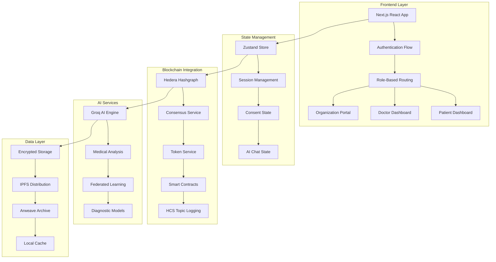

# 🏥 MediLedger Nexus

<div align="center">

**Revolutionizing Healthcare Through Decentralized AI and Blockchain Technology**

[](https://reactjs.org/)
[](https://nextjs.org/)
[](https://www.typescriptlang.org/)
[](https://hedera.com/)
[](https://tailwindcss.com/)
[](https://opensource.org/licenses/MIT)

**AI-Powered • Blockchain-Secured • Patient-Controlled**

[🚀 Live Demo](#) • [📖 Documentation](#) • [💬 Discord](https://discord.gg/mediledger-nexus)

</div>

---

## 🎯 **What is MediLedger Nexus?**

MediLedger Nexus is a **cutting-edge decentralized healthcare platform** that empowers patients with complete control over their medical data while enabling seamless, secure collaboration between healthcare providers and AI systems.

### **🔐 Zero-Knowledge Privacy**
Your medical data stays encrypted and private. **You control who accesses it, when, and for what purpose.**

### **🤖 AI-Powered Diagnostics**
Advanced AI agents provide real-time medical analysis while maintaining complete privacy through federated learning.

### **⚡ Blockchain Security**
Built on Hedera Hashgraph for immutable audit trails and transparent consent management.

---

## 🌟 **Key Features**

### **🔐 NFT-Based Consent Management**
- **Dynamic Consent Tokens**: NFTs represent granular data permissions
- **Instant Revocation**: Withdraw access with a single click
- **Audit Trails**: Every action logged on Hedera Consensus Service
- **Emergency Override**: Critical access when seconds matter

### **🏥 Multi-Role Dashboard System**
- **Patient Portal**: Complete health data control and consent management
- **Doctor Dashboard**: AI-assisted diagnostics and patient management
- **Organization Console**: Multi-facility health system management
- **Research Access**: Privacy-preserving data for medical research

### **🤖 AI Diagnostic Co-Pilot**
- **Multi-Modal Analysis**: Text, imaging, and sensor data integration
- **Federated Learning**: Collaborative AI without data sharing
- **Real-Time Insights**: Sub-second medical analysis powered by Groq AI
- **Specialized Agents**: Cardiology, oncology, emergency medicine experts

### **🚨 Emergency Response Protocol**
- **Smart Triage**: AI-powered emergency severity assessment
- **Global Interoperability**: HL7 FHIR standard compliance
- **Automated Alerts**: Real-time notifications to emergency contacts
- **Break-Glass Access**: Immediate access when lives are at stake

### **🌍 Global Health Interoperability**
- **Cross-Border Records**: Secure international health data exchange
- **Multi-Language Support**: Global accessibility and localization
- **Standards Compliance**: HIPAA, GDPR, and regional regulations
- **HL7 FHIR Integration**: Seamless healthcare system integration

---

## 🏗️ **System Architecture**



---

## 🚀 **Quick Start Guide**

### **Prerequisites**
- **Node.js** 18.0 or later
- **npm** or **yarn** package manager
- **HashPack Wallet** (for Hedera blockchain integration)
- **Modern web browser** (Chrome, Firefox, Safari, Edge)

### **1. Clone and Setup**
```bash
# Clone the repository
git clone https://github.com/your-org/mediledger-nexus-frontend.git
cd mediledger-nexus-frontend

# Install dependencies
npm install
# or
yarn install
```

### **2. Environment Configuration**
```bash
# Copy environment template
cp .env.local.example .env.local

# Edit with your configuration
nano .env.local
```

**Required Environment Variables:**
```bash
# HashConnect Configuration
NEXT_PUBLIC_HASHCONNECT_PROJECT_ID=your-reown-project-id
NEXT_PUBLIC_HEDERA_NETWORK=testnet

# Your Testnet Account (from HashPack)
HEDERA_ACCOUNT_ID=0.0.7123249
HEDERA_PRIVATE_KEY=your-private-key-here

# HCS Topic for Logging
HCS_TOPIC_ID=0.0.12345
NEXT_PUBLIC_HCS_TOPIC_ID=0.0.12345

# Features
NEXT_PUBLIC_ENABLE_HCS=true
```

### **3. Development Server**
```bash
# Start development server
npm run dev
# or
yarn dev
```

🌐 **Access the application at:** `http://localhost:3000`

### **4. Production Build**
```bash
# Build for production
npm run build
npm run start

# or
yarn build
yarn start
```

---

## 📁 **Project Structure**

```
mediledger-nexus-frontend/
├── 📂 app/                          # Next.js 14 App Router
│   ├── 📄 page.tsx                  # Landing page
│   ├── 📄 layout.tsx                # Root layout
│   ├── 📂 auth/                     # Authentication pages
│   ├── 📂 doctor-dashboard/         # Doctor portal
│   ├── 📂 dashboard/                # Patient dashboard
│   └── 📂 api/                      # API routes
├── 📂 components/                   # Reusable React components
│   ├── 📂 ui/                       # Shadcn/UI components
│   ├── 📂 auth/                     # Authentication components
│   ├── 📂 dashboard/                # Dashboard components
│   └── 📂 shared/                   # Shared utilities
├── 📂 lib/                          # Core libraries and utilities
│   ├── 📄 session.ts                # Session management
│   ├── 📄 hedera.ts                 # Hedera integration
│   ├── 📄 consentManager.ts         # Consent management
│   └── 📄 didRegistry.ts            # DID operations
├── 📂 hooks/                        # Custom React hooks
│   ├── 📄 useAIDiagnostic.ts        # AI diagnostic hook
│   ├── 📄 useConsent.ts             # Consent management hook
│   └── 📄 useAuth.ts                # Authentication hook
├── 📂 types/                        # TypeScript type definitions
├── 📂 public/                       # Static assets
├── 📂 styles/                       # Global styles
└── 📄 package.json                  # Dependencies and scripts
```

---

## 🎨 **User Interface & Experience**

### **🎯 Role-Based Dashboards**

#### **Patient Dashboard**
- **Health Record Management**: Upload, organize, and encrypt medical records
- **Consent Control Center**: Grant, modify, or revoke data access permissions
- **AI Health Insights**: Get personalized health analysis and recommendations
- **Emergency Profile**: Critical information for emergency responders

#### **Doctor Dashboard**
- **Patient Management**: Search and manage patient relationships
- **AI Diagnostic Tools**: Real-time medical analysis and second opinions
- **Consent Request System**: Request access to patient data with clear purposes
- **Emergency Access Protocol**: Critical patient data access when needed

#### **Organization Portal**
- **Multi-Facility Management**: Oversee multiple healthcare facilities
- **Staff Permission Management**: Control access levels and data permissions
- **Analytics & Reporting**: Health system performance and compliance metrics
- **Research Data Access**: Privacy-preserving research partnerships

---

## 🔐 **Security & Privacy**

### **🛡️ Data Protection**
- **End-to-End Encryption**: AES-256 encryption for all medical data
- **Zero-Knowledge Proofs**: Verify data validity without revealing content
- **Blockchain Audit Trails**: Immutable logs of all data access
- **Multi-Factor Authentication**: Wallet-based identity verification

### **⚖️ Compliance**
- **HIPAA Compliant**: Healthcare data protection standards
- **GDPR Ready**: European data protection regulations
- **HL7 FHIR Standards**: Healthcare interoperability protocols
- **Audit Logging**: Comprehensive compliance reporting

---

## 🤖 **AI Integration**

### **🧠 Advanced AI Features**
- **Medical Diagnosis**: Multi-specialty AI diagnostic assistance
- **Risk Assessment**: Predictive health risk analysis
- **Treatment Recommendations**: Evidence-based treatment suggestions
- **Drug Interaction Checking**: Real-time medication safety analysis

### **🔒 Privacy-Preserving AI**
- **Federated Learning**: Train models without sharing raw data
- **Homomorphic Encryption**: Compute on encrypted data
- **Differential Privacy**: Statistical analysis without individual identification
- **Zero-Trust Architecture**: Every AI request is verified and logged

---

## 🌐 **Blockchain Integration**

### **⚡ Hedera Hashgraph**
- **High Throughput**: 10,000+ transactions per second
- **Low Latency**: 3-5 second finality
- **Enterprise Security**: Bank-grade security and reliability
- **Tokenization**: Native token creation and management

### **🔗 Smart Contracts**
- **Consent NFTs**: Tokenized access permissions
- **Automated Payments**: Smart contract-based compensation
- **Governance**: Community-driven protocol decisions
- **Escrow Services**: Secure data marketplace transactions

---

## 🧪 **Development & Testing**

### **Development Workflow**
```bash
# Install dependencies
npm install

# Start development server with hot reload
npm run dev

# Run tests
npm test

# Build for production
npm run build

# Run linting
npm run lint

# Format code
npm run format
```

### **Testing Strategy**
- **Unit Tests**: Component and utility function testing
- **Integration Tests**: End-to-end user journey testing
- **E2E Tests**: Full browser automation testing
- **Performance Tests**: Load testing and optimization

### **Code Quality**
- **TypeScript**: Full type safety and IntelliSense
- **ESLint**: Code linting and style enforcement
- **Prettier**: Code formatting and consistency
- **Husky**: Pre-commit hooks and automated checks

---

## 📚 **API Documentation**

### **Authentication Endpoints**
```typescript
// User Registration
POST /api/auth/register
{
  "phoneNumber": "+1234567890",
  "role": "doctor" | "patient" | "organization",
  "profile": { /* user profile data */ }
}

// Wallet Connection
POST /api/auth/connect-wallet
{
  "accountId": "0.0.7123249",
  "publicKey": "base64-encoded-key",
  "signature": "wallet-signature"
}
```

### **Consent Management**
```typescript
// Request Consent
POST /api/consent/request
{
  "doctorDid": "did:hedera:testnet:0.0.123456",
  "patientDid": "did:hedera:testnet:0.0.789012",
  "permissions": ["read", "write"],
  "purpose": "Medical consultation",
  "expiryDays": 30
}

// Grant Consent
POST /api/consent/grant
{
  "requestId": "consent-req-123",
  "signature": "patient-signature"
}
```

---

## 🚀 **Deployment Guide**

### **Environment Setup**
```bash
# Production environment variables
NEXT_PUBLIC_API_URL=https://api.mediledger-nexus.com
NEXT_PUBLIC_HEDERA_NETWORK=mainnet
NEXT_PUBLIC_ENABLE_ANALYTICS=true

# Security
NEXTAUTH_SECRET=your-secret-key
NEXTAUTH_URL=https://mediledger-nexus.com
```

### **Docker Deployment**
```dockerfile
FROM node:18-alpine AS builder
WORKDIR /app
COPY package*.json ./
RUN npm ci --only=production

FROM node:18-alpine AS runner
WORKDIR /app
COPY --from=builder /app/next.config.js ./
COPY --from=builder /app/public ./public
COPY --from=builder /app/.next ./.next
COPY --from=builder /app/node_modules ./node_modules
COPY --from=builder /app/package.json ./package.json

EXPOSE 3000
CMD ["npm", "start"]
```

---

## 🤝 **Contributing**

We welcome contributions from the healthcare and blockchain communities!

### **Development Setup**
1. **Fork** the repository
2. **Clone** your fork: `git clone https://github.com/your-username/mediledger-nexus-frontend.git`
3. **Install** dependencies: `npm install`
4. **Create** a feature branch: `git checkout -b feature/amazing-feature`
5. **Make** your changes and add tests
6. **Test** thoroughly: `npm test`
7. **Commit** your changes: `git commit -m 'Add amazing feature'`
8. **Push** to your branch: `git push origin feature/amazing-feature`
9. **Open** a Pull Request

### **Contribution Guidelines**
- Follow TypeScript best practices
- Add comprehensive tests for new features
- Update documentation for any changes
- Ensure accessibility compliance (WCAG 2.1)
- Maintain security best practices

---

## 📈 **Performance & Metrics**

### **🏆 Performance Benchmarks**
- **First Contentful Paint**: < 1.5s
- **Largest Contentful Paint**: < 2.5s
- **Cumulative Layout Shift**: < 0.1
- **Time to Interactive**: < 3.5s

### **🔧 Optimization Features**
- **Code Splitting**: Automatic route-based splitting
- **Image Optimization**: Next.js Image component with WebP
- **Bundle Analysis**: Webpack bundle analyzer integration
- **Caching Strategy**: Aggressive caching for static assets

---

## 🌟 **Use Cases & Impact**

### **🏥 Healthcare Providers**
- **Streamlined Patient Intake**: Digital forms and automated data collection
- **AI-Assisted Diagnostics**: Second opinions and treatment recommendations
- **Interoperable Records**: Access patient data from any healthcare system
- **Compliance Automation**: Automated HIPAA and GDPR compliance reporting

### **👥 Patients**
- **Data Ownership**: Complete control over medical information
- **Privacy Protection**: Zero-knowledge data sharing
- **Emergency Access**: Critical information available when needed
- **Health Insights**: AI-powered health analysis and recommendations

### **🔬 Medical Research**
- **Privacy-Preserving Studies**: Research without compromising patient privacy
- **Federated Learning**: Collaborative AI model training
- **Real-World Evidence**: Access to diverse, real-world health data
- **Clinical Trials**: Streamlined patient recruitment and consent

---

## 🗺️ **Roadmap**

### **Phase 1: Foundation** ✅
- [x] Core authentication system
- [x] Basic dashboard interfaces
- [x] NFT-based consent management
- [x] Hedera blockchain integration

### **Phase 2: Enhancement** 🚧
- [ ] Advanced AI diagnostic features
- [ ] Mobile application development
- [ ] Multi-language support
- [ ] Enhanced security protocols

### **Phase 3: Scale** 📋
- [ ] Enterprise deployment tools
- [ ] Global healthcare network
- [ ] Advanced analytics platform
- [ ] API marketplace

### **Phase 4: Innovation** 🎯
- [ ] Metaverse healthcare integration
- [ ] Advanced federated learning
- [ ] Quantum-resistant encryption
- [ ] Global health data commons

---

## ❓ **Frequently Asked Questions**

### **🔐 How secure is my medical data?**
Your medical data is encrypted with AES-256 and stored in a decentralized manner. Access requires explicit consent via NFT tokens, and all activities are logged on the Hedera blockchain for complete transparency.

### **🤖 How does the AI work without seeing my data?**
We use federated learning and zero-knowledge proofs. AI models are trained on encrypted data patterns without ever accessing raw medical information.

### **⚡ Why Hedera instead of other blockchains?**
Hedera offers enterprise-grade security, 10,000+ TPS throughput, 3-5 second finality, and carbon-negative operations - perfect for healthcare applications.

### **🔄 Can I export my data?**
Yes! You have complete data portability. Export your health records in standard formats (HL7 FHIR, JSON, PDF) at any time.

### **🚨 What happens in emergencies?**
Emergency access protocols allow healthcare providers to access critical information instantly when lives are at stake, with full audit logging.

---

## 🆘 **Troubleshooting**

### **Common Issues**

**❌ HashPack Connection Failing**
```bash
# Check environment variables
echo $NEXT_PUBLIC_HASHCONNECT_PROJECT_ID
echo $NEXT_PUBLIC_HEDERA_NETWORK

# Reset HashPack DApp connections
# Clear browser data and reconnect
```

**❌ Dashboard Not Loading**
```bash
# Check console for errors
# Verify session token validity
# Clear localStorage and re-authenticate
```

**❌ NFT Operations Failing**
```bash
# Verify Hedera account balance
# Check private key format (should start with 302e0201)
# Confirm testnet configuration
```

### **Debug Commands**
```bash
# View session data
console.log(localStorage.getItem('mediledger_session'))

# Check Hedera configuration
console.log('Network:', process.env.NEXT_PUBLIC_HEDERA_NETWORK)
console.log('Account:', process.env.HEDERA_ACCOUNT_ID)
```

---

## 📄 **License & Legal**

### **Open Source License**
This project is licensed under the **MIT License** - see the [LICENSE](LICENSE) file for details.

### **Medical Disclaimer**
This software is for research and educational purposes. Always consult licensed healthcare professionals for medical decisions. This system supplements but does not replace professional medical care.

### **Compliance**
- **HIPAA**: Healthcare data protection compliance
- **GDPR**: European data protection standards
- **HL7 FHIR**: Healthcare interoperability standards
- **Medical Device**: Research use only designation

---

## 🙏 **Acknowledgments**

### **🔗 Partners & Technology**
- **Hedera Hashgraph** - Revolutionary DLT platform
- **Groq** - Ultra-fast AI inference
- **HashPack** - Hedera wallet ecosystem
- **React & Next.js** - Modern web development
- **Tailwind CSS** - Beautiful UI components

### **🏥 Healthcare Community**
- **Medical Professionals** - Clinical expertise and validation
- **Healthcare Organizations** - Real-world implementation feedback
- **Research Institutions** - Academic partnerships and studies
- **Patient Advocates** - Privacy and rights guidance

### **💻 Open Source Community**
- **Contributors** - Code, documentation, and design
- **Beta Testers** - Early feedback and bug reports
- **Security Researchers** - Vulnerability assessments
- **Documentation Writers** - Clear usage guides

---

## 📞 **Get Involved**

<div align="center">

**Ready to revolutionize healthcare?**

[🚀 **Get Started**](#quick-start-guide) • [💬 **Join Discord**](https://discord.gg/mediledger-nexus) • [🐦 **Follow Twitter**](https://twitter.com/MediLedgerNexus)

**Built with ❤️ for the future of healthcare**

[](https://github.com/your-org/mediledger-nexus-frontend)
[](https://github.com/your-org/mediledger-nexus-frontend/fork)

</div>

---

<div align="center">

**MediLedger Nexus** • Empowering patients, enabling providers, advancing healthcare

[📖 Documentation](#) • [🚀 Demo](#) • [💬 Community](https://discord.gg/mediledger-nexus) • [🐦 Twitter](https://twitter.com/MediLedgerNexus)

</div>
