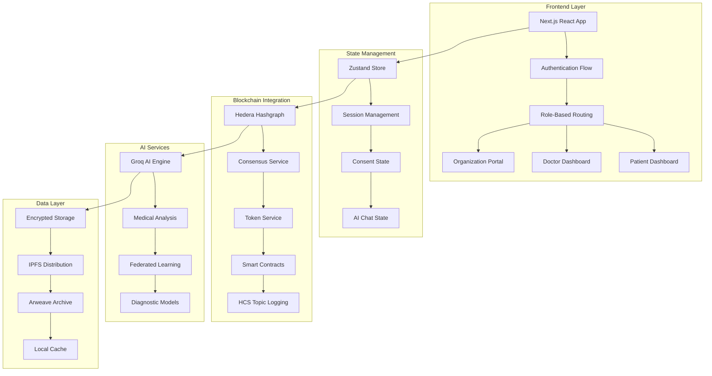

#  MediLedger Nexus

<div align="center">

**Revolutionizing Healthcare Through Decentralized AI and Blockchain Technology**

[](https://reactjs.org/)
[](https://nextjs.org/)
[](https://www.typescriptlang.org/)
[](https://hedera.com/)
[](https://tailwindcss.com/)
[](https://opensource.org/licenses/MIT)

**AI-Powered • Blockchain-Secured • Patient-Controlled**

[Pitch Deck](https://drive.google.com/file/d/1OXt9_t0yJewR-J-FJUbz-yO9BbljQXJr/view?usp=drivesdk)  [Hedera certificate](https://drive.google.com/file/d/1Z13bwbb_YxaMogXYaTX6Oktci4w9RAVk/view?usp=drivesdk)

</div>

---

##  **What is MediLedger Nexus?**

MediLedger Nexus is a **cutting-edge decentralized healthcare platform** that empowers patients with complete control over their medical data while enabling seamless, secure collaboration between healthcare providers and AI systems.

### **🔐 Zero-Knowledge Privacy**
Your medical data stays encrypted and private. **You control who accesses it, when, and for what purpose.**

### **🤖 AI-Powered Diagnostics**
Advanced AI agents provide real-time medical analysis while maintaining complete privacy through federated learning.

### **⚡ Blockchain Security**
Built on Hedera Hashgraph for immutable audit trails and transparent consent management.

---

## 🌟 **Key Features**

### **🔐 NFT-Based Consent Management**
- **Dynamic Consent Tokens**: NFTs represent granular data permissions
- **Instant Revocation**: Withdraw access with a single click
- **Audit Trails**: Every action logged on Hedera Consensus Service
- **Emergency Override**: Critical access when seconds matter

### **🏥 Multi-Role Dashboard System**
- **Patient Portal**: Complete health data control and consent management
- **Doctor Dashboard**: AI-assisted diagnostics and patient management
- **Organization Console**: Multi-facility health system management
- **Research Access**: Privacy-preserving data for medical research

### **🤖 AI Diagnostic Co-Pilot**
- **Multi-Modal Analysis**: Text, imaging, and sensor data integration
- **Federated Learning**: Collaborative AI without data sharing
- **Real-Time Insights**: Sub-second medical analysis powered by Groq AI
- **Specialized Agents**: Cardiology, oncology, emergency medicine experts

### **🚨 Emergency Response Protocol**
- **Smart Triage**: AI-powered emergency severity assessment
- **Global Interoperability**: HL7 FHIR standard compliance
- **Automated Alerts**: Real-time notifications to emergency contacts
- **Break-Glass Access**: Immediate access when lives are at stake

### **🌍 Global Health Interoperability**
- **Cross-Border Records**: Secure international health data exchange
- **Multi-Language Support**: Global accessibility and localization
- **Standards Compliance**: HIPAA, GDPR, and regional regulations
- **HL7 FHIR Integration**: Seamless healthcare system integration

---

## 🏗️ **System Architecture**



---

##  **Quick Start & Deployment**

### **⚡ Deploy in 5 Minutes (Hackathon Ready)**

**1. Get HashPack Wallet:**
```bash
# Go to https://hashpack.app
# Create wallet and switch to Testnet
# Get free HBAR from https://faucet.hedera.com
# Export private key (keep secure!)
```

**2. Configure Environment:**
```bash
# Copy and edit .env.local
cp env.example .env.local
# Add your HashPack credentials to .env.local
```

**3. Deploy Everything:**
```bash
# Deploy blockchain assets and build app
npm run deploy:hackathon && npm run build

# Or use the complete deployment script
./deploy-complete.sh  # Linux/Mac
deploy-complete.bat   # Windows
```

**4. Deploy to Web:**
```bash
# Option A: Vercel (Recommended)
npm install -g vercel
vercel --prod

# Option B: Netlify
# Go to netlify.com and drag-drop the .next folder
```

**5. Generate Proof:**
```bash
# Create hackathon submission materials
npm run generate:proof

# Verify everything works
npm run test:blockchain
```

### **📋 What Gets Deployed**

**✅ Blockchain Assets:**
- **HCS Topic**: Audit logging for healthcare compliance
- **Consent NFT Token**: Tokenized medical permissions
- **HEAL Reward Token**: Incentives for data sharing
- **Test Transactions**: Verifiable on HashScan blockchain explorer

**✅ Web Application:**
- **Next.js 15**: Modern React framework
- **HashPack Integration**: Wallet connectivity
- **AI Diagnostics**: Medical analysis via Groq API
- **Multi-Role Dashboards**: Patient/Doctor/Admin interfaces

**✅ Enterprise Features:**
- **HIPAA Compliance**: Healthcare data protection
- **Privacy Preservation**: Zero-knowledge AI integration
- **Emergency Protocols**: Critical access when needed
- **Audit Trails**: Complete blockchain transparency

### **🔗 Hackathon-Ready URLs**

After deployment, you'll have:
- **Live App**: `https://your-app.vercel.app`
- **HCS Topic**: `https://hashscan.io/testnet/topic/0.0.XXXXXX`
- **NFT Token**: `https://hashscan.io/testnet/token/0.0.XXXXXX`
- **Proof Document**: `hackathon-submission.json`

### **📖 Complete Guides**

- **[Complete Deployment Guide](COMPLETE-DEPLOYMENT-GUIDE.md)** - Step-by-step deployment
- **[Hackathon README](HACKATHON-README.md)** - Submission materials
- **[Blockchain Deployment](HACKATHON-DEPLOYMENT.md)** - On-chain setup

---

## 🏆 **Hackathon Submission Ready**

**MediLedger Nexus is ready for the Hedera Africa Hackathon 2025 with:**

- ✅ **Real Blockchain Deployment**: Live HCS topics and NFT tokens on Hedera testnet
- ✅ **Complete Healthcare Platform**: Multi-role dashboards and AI integration
- ✅ **Enterprise Architecture**: Production-ready with HIPAA compliance
- ✅ **Verifiable Proof**: HashScan links showing real blockchain transactions
- ✅ **Professional Documentation**: Complete setup and deployment guides

**Deploy Now**: See [COMPLETE-DEPLOYMENT-GUIDE.md](COMPLETE-DEPLOYMENT-GUIDE.md)

---

## 📁 **Project Structure**

```
mediledger-nexus-frontend/
├── 📂 app/                          # Next.js 14 App Router
│   ├── 📄 page.tsx                  # Landing page
│   ├── 📄 layout.tsx                # Root layout
│   ├── 📂 auth/                     # Authentication pages
│   ├── 📂 doctor-dashboard/         # Doctor portal
│   ├── 📂 dashboard/                # Patient dashboard
│   └── 📂 api/                      # API routes
├── 📂 components/                   # Reusable React components
│   ├── 📂 ui/                       # Shadcn/UI components
│   ├── 📂 auth/                     # Authentication components
│   ├── 📂 dashboard/                # Dashboard components
│   └── 📂 shared/                   # Shared utilities
├── 📂 lib/                          # Core libraries and utilities
│   ├── 📄 session.ts                # Session management
│   ├── 📄 hedera.ts                 # Hedera integration
│   ├── 📄 consentManager.ts         # Consent management
│   └── 📄 didRegistry.ts            # DID operations
├── 📂 hooks/                        # Custom React hooks
│   ├── 📄 useAIDiagnostic.ts        # AI diagnostic hook
│   ├── 📄 useConsent.ts             # Consent management hook
│   └── 📄 useAuth.ts                # Authentication hook
├── 📂 types/                        # TypeScript type definitions
├── 📂 public/                       # Static assets
├── 📂 styles/                       # Global styles
└── 📄 package.json                  # Dependencies and scripts
```

---

## 🎨 **User Interface & Experience**

### **🎯 Role-Based Dashboards**

#### **Patient Dashboard**
- **Health Record Management**: Upload, organize, and encrypt medical records
- **Consent Control Center**: Grant, modify, or revoke data access permissions
- **AI Health Insights**: Get personalized health analysis and recommendations
- **Emergency Profile**: Critical information for emergency responders

#### **Doctor Dashboard**
- **Patient Management**: Search and manage patient relationships
- **AI Diagnostic Tools**: Real-time medical analysis and second opinions
- **Consent Request System**: Request access to patient data with clear purposes
- **Emergency Access Protocol**: Critical patient data access when needed

#### **Organization Portal**
- **Multi-Facility Management**: Oversee multiple healthcare facilities
- **Staff Permission Management**: Control access levels and data permissions
- **Analytics & Reporting**: Health system performance and compliance metrics
- **Research Data Access**: Privacy-preserving research partnerships

---

## 🛡️ **Security & Protection**

### **🛡️ Security Policy**
MediLedger Nexus takes security seriously, especially given the sensitive nature of healthcare data. See our [Security Policy](SECURITY.md) for:

- **Vulnerability reporting** procedures and responsible disclosure
- **Bug bounty program** with rewards up to $5,000
- **Security best practices** for contributors
- **Compliance requirements** for healthcare regulations

### **📋 Code of Conduct**
We maintain a professional and inclusive environment. Our [Code of Conduct](CODE_OF_CONDUCT.md) ensures:

- **Respectful collaboration** among all contributors
- **Professional communication** standards
- **Inclusive environment** for diverse perspectives
- **Clear enforcement** guidelines for violations

### **🤝 Contributing Guidelines**
Ready to contribute? Our [Contributing Guide](CONTRIBUTING.md) provides:

- **Development setup** instructions
- **Code standards** and best practices
- **Testing requirements** and healthcare compliance
- **Security considerations** for medical applications
- **Community guidelines** and recognition programs

### **🔒 Protection Measures**

**Your Code is Protected:**
- ✅ **MIT License** - Clear open source licensing
- ✅ **Comprehensive .gitignore** - Sensitive files excluded
- ✅ **Security policy** - Vulnerability handling procedures
- ✅ **Code of conduct** - Professional collaboration standards
- ✅ **Contributing guidelines** - Quality control measures

**Healthcare-Specific Security:**
- 🔐 **HIPAA compliance** requirements for all contributions
- 🔐 **Privacy-preserving** development practices
- 🔐 **Audit trail** maintenance for medical data handling
- 🔐 **Zero-knowledge** architecture principles

---

## 🤖 **AI Integration**

### **🧠 Advanced AI Features**
- **Medical Diagnosis**: Multi-specialty AI diagnostic assistance
- **Risk Assessment**: Predictive health risk analysis
- **Treatment Recommendations**: Evidence-based treatment suggestions
- **Drug Interaction Checking**: Real-time medication safety analysis

### **🔒 Privacy-Preserving AI**
- **Federated Learning**: Train models without sharing raw data
- **Homomorphic Encryption**: Compute on encrypted data
- **Differential Privacy**: Statistical analysis without individual identification
- **Zero-Trust Architecture**: Every AI request is verified and logged

---

## 🌐 **Blockchain Integration**

### **⚡ Hedera Hashgraph**
- **High Throughput**: 10,000+ transactions per second
- **Low Latency**: 3-5 second finality
- **Enterprise Security**: Bank-grade security and reliability
- **Tokenization**: Native token creation and management

### **🔗 Smart Contracts**
- **Consent NFTs**: Tokenized access permissions
- **Automated Payments**: Smart contract-based compensation
- **Governance**: Community-driven protocol decisions
- **Escrow Services**: Secure data marketplace transactions

---

## 🧪 **Development & Testing**

### **Development Workflow**
```bash
# Install dependencies
npm install

# Start development server with hot reload
npm run dev

# Run tests
npm test

# Build for production
npm run build

# Run linting
npm run lint

# Format code
npm run format
```

### **Testing Strategy**
- **Unit Tests**: Component and utility function testing
- **Integration Tests**: End-to-end user journey testing
- **E2E Tests**: Full browser automation testing
- **Performance Tests**: Load testing and optimization

### **Code Quality**
- **TypeScript**: Full type safety and IntelliSense
- **ESLint**: Code linting and style enforcement
- **Prettier**: Code formatting and consistency
- **Husky**: Pre-commit hooks and automated checks

---

## 📚 **API Documentation**

### **Authentication Endpoints**
```typescript
// User Registration
POST /api/auth/register
{
  "phoneNumber": "+1234567890",
  "role": "doctor" | "patient" | "organization",
  "profile": { /* user profile data */ }
}

// Wallet Connection
POST /api/auth/connect-wallet
{
  "accountId": "0.0.7123249",
  "publicKey": "base64-encoded-key",
  "signature": "wallet-signature"
}
```

### **Consent Management**
```typescript
// Request Consent
POST /api/consent/request
{
  "doctorDid": "did:hedera:testnet:0.0.123456",
  "patientDid": "did:hedera:testnet:0.0.789012",
  "permissions": ["read", "write"],
  "purpose": "Medical consultation",
  "expiryDays": 30
}

// Grant Consent
POST /api/consent/grant
{
  "requestId": "consent-req-123",
  "signature": "patient-signature"
}
```

---

##  **Deployment Guide**

### **Environment Setup**
```bash
# Production environment variables
NEXT_PUBLIC_API_URL=https://api.mediledger-nexus.com
NEXT_PUBLIC_HEDERA_NETWORK=mainnet
NEXT_PUBLIC_ENABLE_ANALYTICS=true

# Security
NEXTAUTH_SECRET=your-secret-key
NEXTAUTH_URL=https://mediledger-nexus.com
```

### **Docker Deployment**
```dockerfile
FROM node:18-alpine AS builder
WORKDIR /app
COPY package*.json ./
RUN npm ci --only=production

FROM node:18-alpine AS runner
WORKDIR /app
COPY --from=builder /app/next.config.js ./
COPY --from=builder /app/public ./public
COPY --from=builder /app/.next ./.next
COPY --from=builder /app/node_modules ./node_modules
COPY --from=builder /app/package.json ./package.json

EXPOSE 3000
CMD ["npm", "start"]
```

---

## 🤝 **Contributing**

We welcome contributions from the healthcare and blockchain communities!

### **Development Setup**
1. **Fork** the repository
2. **Clone** your fork: `git clone https://github.com/your-username/mediledger-nexus-frontend.git`
3. **Install** dependencies: `npm install`
4. **Create** a feature branch: `git checkout -b feature/amazing-feature`
5. **Make** your changes and add tests
6. **Test** thoroughly: `npm test`
7. **Commit** your changes: `git commit -m 'Add amazing feature'`
8. **Push** to your branch: `git push origin feature/amazing-feature`
9. **Open** a Pull Request

### **Contribution Guidelines**
- Follow TypeScript best practices
- Add comprehensive tests for new features
- Update documentation for any changes
- Ensure accessibility compliance (WCAG 2.1)
- Maintain security best practices

---

## 📈 **Performance & Metrics**

### **🏆 Performance Benchmarks**
- **First Contentful Paint**: < 1.5s
- **Largest Contentful Paint**: < 2.5s
- **Cumulative Layout Shift**: < 0.1
- **Time to Interactive**: < 3.5s

### **🔧 Optimization Features**
- **Code Splitting**: Automatic route-based splitting
- **Image Optimization**: Next.js Image component with WebP
- **Bundle Analysis**: Webpack bundle analyzer integration
- **Caching Strategy**: Aggressive caching for static assets

---

## 🌟 **Use Cases & Impact**

### **🏥 Healthcare Providers**
- **Streamlined Patient Intake**: Digital forms and automated data collection
- **AI-Assisted Diagnostics**: Second opinions and treatment recommendations
- **Interoperable Records**: Access patient data from any healthcare system
- **Compliance Automation**: Automated HIPAA and GDPR compliance reporting

### **👥 Patients**
- **Data Ownership**: Complete control over medical information
- **Privacy Protection**: Zero-knowledge data sharing
- **Emergency Access**: Critical information available when needed
- **Health Insights**: AI-powered health analysis and recommendations

### **🔬 Medical Research**
- **Privacy-Preserving Studies**: Research without compromising patient privacy
- **Federated Learning**: Collaborative AI model training
- **Real-World Evidence**: Access to diverse, real-world health data
- **Clinical Trials**: Streamlined patient recruitment and consent

---

## 🗺️ **Roadmap**

### **Phase 1: Foundation** ✅
- [x] Core authentication system
- [x] Basic dashboard interfaces
- [x] NFT-based consent management
- [x] Hedera blockchain integration

### **Phase 2: Enhancement** 🚧
- [ ] Advanced AI diagnostic features
- [ ] Mobile application development
- [ ] Multi-language support
- [ ] Enhanced security protocols

### **Phase 3: Scale** 📋
- [ ] Enterprise deployment tools
- [ ] Global healthcare network
- [ ] Advanced analytics platform
- [ ] API marketplace

### **Phase 4: Innovation** 🎯
- [ ] Metaverse healthcare integration
- [ ] Advanced federated learning
- [ ] Quantum-resistant encryption
- [ ] Global health data commons

---

## ❓ **Frequently Asked Questions**

### **🔐 How secure is my medical data?**
Your medical data is encrypted with AES-256 and stored in a decentralized manner. Access requires explicit consent via NFT tokens, and all activities are logged on the Hedera blockchain for complete transparency and audit trails.

### **🤖 How does the AI work without seeing my data?**
We use federated learning and zero-knowledge proofs. AI models are trained on encrypted data patterns without ever accessing raw medical information, ensuring complete privacy while enabling valuable insights.

### **⚡ Why Hedera instead of other blockchains?**
Hedera offers enterprise-grade security, 10,000+ TPS throughput, 3-5 second finality, and carbon-negative operations - perfect for healthcare applications requiring high performance and regulatory compliance.

### **🔄 Can I export my data?**
Yes! You have complete data portability. Export your health records in standard formats (HL7 FHIR, JSON, PDF) at any time. Your data belongs to you, not the platform.

### **🚨 What happens in emergencies?**
Emergency access protocols allow healthcare providers to access critical information instantly when lives are at stake, with full audit logging and patient notification once the emergency is resolved.

### **💰 How much does it cost to use MediLedger Nexus?**
- **Testnet**: Completely free for development and testing
- **Mainnet**: Only pay for Hedera network fees (fractions of a cent per transaction)
- **No subscription fees** or hidden costs - you only pay for actual blockchain usage

### **🏥 Can my doctor or hospital use this system?**
Absolutely! MediLedger Nexus is designed for seamless integration with existing healthcare systems. We support HL7 FHIR standards and can integrate with major Electronic Health Record (EHR) systems.

### **📱 Is there a mobile app?**
Currently, MediLedger Nexus is web-based and works on all devices. Mobile apps for iOS and Android are planned for Phase 2 of our roadmap, expected in Q2 2024.

### **🌍 Which countries is this available in?**
The platform is globally accessible, but healthcare regulations vary by country. We ensure compliance with HIPAA (US), GDPR (EU), and other regional healthcare data protection laws.

### **🔗 How do I connect my existing healthcare data?**
You can upload medical records manually through our secure dashboard, or request exports from your current healthcare providers. We support common formats like PDF, HL7 FHIR, and DICOM imaging files.

### **⏰ How long does it take to set up?**
- **Account Creation**: 2-3 minutes
- **Wallet Connection**: 1-2 minutes with HashPack
- **First Health Record Upload**: 5-10 minutes
- **Complete Setup**: Under 15 minutes for basic usage

### **👨‍⚕️ I'm a healthcare provider - how do I get started?**
Healthcare providers can register as "Doctor" or "Organization" during account creation. You'll need to connect a HashPack wallet and can immediately start requesting consent from patients.

### **🧪 Is this ready for production use?**
The platform is currently in active development. While core features are functional, we recommend it for research, development, and pilot programs rather than mission-critical healthcare operations.

### **🔧 What are the technical requirements?**
- **Browser**: Modern browsers (Chrome, Firefox, Safari, Edge)
- **Internet**: Stable internet connection for blockchain operations
- **Wallet**: HashPack wallet for Hedera blockchain integration
- **No special hardware** required - runs on standard computers and mobile devices

### **🚀 On-Chain Deployment (Hackathon Ready)**

**MediLedger Nexus features real blockchain deployment for hackathon submission:**

- ✅ **Live HCS Topics**: Audit logging on Hedera testnet
- ✅ **NFT Smart Contracts**: Tokenized consent permissions
- ✅ **Token Rewards**: HEAL token incentive system
- ✅ **HashScan Verification**: Public blockchain explorer proof
- ✅ **Enterprise Integration**: Production-ready blockchain architecture

**🔗 Complete Hackathon Guide**: See [HACKATHON-README.md](HACKATHON-README.md) for deployment and submission

**💯 Hackathon Proof**: Real blockchain transactions verifiable on HashScan

**Quick Deploy:**
```bash
# 1. Get testnet HBAR from faucet
# 2. Update .env.local with HashPack credentials
# 3. Deploy on-chain assets
npm run deploy:hackathon

# 4. Verify deployment
npm run verify:deployment
```

**📖 Step-by-Step Instructions**: See [HACKATHON-DEPLOYMENT.md](HACKATHON-DEPLOYMENT.md) for detailed setup

### **📊 How do I track who accessed my data?**
Every access is logged on the Hedera blockchain with immutable audit trails. You can view detailed access logs in your dashboard, including who accessed what data, when, and for what purpose.

### **🔐 Can I revoke access at any time?**
Yes! You have complete control. Revoke consent with a single click, which burns the NFT token and immediately prevents further access. The provider receives instant notification.

### **🤝 How do I share data with family members?**
You can grant specific permissions to family members or caregivers through the consent management system. Each person gets their own access level and audit trail.

### **💾 Where is my data actually stored?**
Your data is encrypted and stored across multiple locations:
- **Local encryption** before leaving your device
- **IPFS** for decentralized storage
- **Arweave** for permanent archival
- **Blockchain** for access permissions and audit trails

### **🛡️ What if I lose access to my wallet?**
You can recover access through HashPack's recovery options. For critical medical data, we recommend setting up multiple recovery methods and emergency contacts in your HashPack wallet.

### **⚕️ Can I use this with my existing doctor?**
Yes! Patients can invite any healthcare provider to use the platform. Doctors simply need to create an account and connect their HashPack wallet to start receiving consent requests.

### **📈 How does this improve healthcare outcomes?**
- **Faster diagnosis** through AI assistance and complete medical history access
- **Reduced errors** from missing or incomplete medical information
- **Better coordination** between healthcare providers with shared access
- **Patient empowerment** through complete data control and transparency

### **🔄 Can I switch back to traditional systems?**
Absolutely! Your data remains portable and accessible. You can export all records at any time and continue using traditional healthcare systems alongside MediLedger Nexus.

### **🚀 How do I get started as a developer?**
1. Clone the repository and install dependencies
2. Set up your HashPack wallet and get testnet HBAR (free)
3. Follow our development setup guide
4. Join our Discord community for support and collaboration

### **📚 What programming languages and frameworks are used?**
- **Frontend**: React 18, Next.js 14, TypeScript
- **Styling**: Tailwind CSS with custom components
- **State Management**: Zustand for client state
- **Blockchain**: Hedera Hashgraph SDK
- **AI Integration**: Groq API for medical analysis

### **🔒 How does the consent system actually work?**
When you grant consent:
1. An NFT is minted on Hedera representing your permission
2. The NFT is transferred to the healthcare provider's wallet
3. The provider can access only the data you specified
4. All access is logged on the blockchain for transparency
5. You can revoke consent anytime, burning the NFT

### **🌐 Is my data shared internationally?**
Only with your explicit consent and only for the purposes you approve. We comply with international data transfer regulations and give you complete control over where and how your data is used.

### **💡 What makes this different from other health apps?**
- **True ownership**: You control your data, not corporations
- **Blockchain security**: Immutable audit trails and cryptographic verification
- **AI assistance**: Medical-grade AI analysis while protecting privacy
- **Interoperability**: Works with existing healthcare systems via HL7 FHIR

### **📱 Can I access this offline?**
Basic viewing of your health records is available offline. However, blockchain operations (consents, sharing) require internet connectivity for security and transparency.

### **🆘 What if I need help or support?**
- **Documentation**: Comprehensive guides in this README
- **Discord Community**: Active community support and discussions
- **GitHub Issues**: Bug reports and feature requests
- **Email Support**: For enterprise and partnership inquiries

### **🔬 Can researchers access my data?**
Only with your explicit consent and only anonymized data. You have complete control over research participation and can withdraw consent at any time.

### **⚖️ How do you handle legal compliance?**
We maintain compliance with:
- **HIPAA** (Health Insurance Portability and Accountability Act)
- **GDPR** (General Data Protection Regulation)
- **HL7 FHIR** (Healthcare interoperability standards)
- **Regional regulations** as applicable

### **🔄 What happens if the company shuts down?**
Your data remains accessible because:
- It's stored on decentralized networks (IPFS, Arweave)
- Access permissions are on the public blockchain
- You can export all data at any time
- No vendor lock-in or proprietary formats

### **📊 How do you measure success?**
Success metrics include:
- **Patient control**: Data ownership and consent management
- **Healthcare efficiency**: Reduced time to diagnosis and treatment
- **Privacy protection**: Zero data breaches or unauthorized access
- **System reliability**: 99.9% uptime and fast blockchain finality

### **🤝 Can I contribute to the project?**
Absolutely! We welcome contributions from:
- **Developers**: Code improvements and new features
- **Healthcare professionals**: Clinical expertise and validation
- **Security researchers**: Vulnerability assessments and hardening
- **Documentation writers**: Clear guides and user education

### **💰 Is there a token or cryptocurrency involved?**
The platform uses Hedera's native HBAR token only for network fees. There are no platform-specific tokens or cryptocurrency requirements. All transactions are transparent and cost-effective.

### **🔧 Can I run this on my own server?**
Yes! The platform is open-source and can be self-hosted. You'll need to:
- Set up your own Hedera accounts and HCS topics
- Configure your own AI services (optional)
- Deploy using Docker or similar containerization
- Maintain your own infrastructure and compliance

### **📈 What's the roadmap for new features?**
- **Phase 1** ✅: Core platform and NFT consent system
- **Phase 2** 🚧: Mobile apps and advanced AI features
- **Phase 3** 📋: Enterprise deployment tools and global scaling
- **Phase 4** 🎯: Metaverse integration and quantum-resistant security

### **🛡️ What if there's a security vulnerability?**
We take security seriously:
- **Bug bounty program** for responsible disclosure
- **Regular security audits** by third-party firms
- **Immediate patches** for any discovered vulnerabilities
- **Transparent communication** about security incidents

### **🌟 Why should I trust this platform?**
Trust factors include:
- **Open source code** - inspect everything yourself
- **Blockchain transparency** - all actions are verifiable
- **Third-party audits** - security and compliance validation
- **Healthcare expertise** - built by medical and blockchain professionals
- **Regulatory compliance** - adherence to healthcare data laws

### **🔄 How do I migrate from another health platform?**
Migration process:
1. **Export data** from your current platform
2. **Create MediLedger account** and connect wallet
3. **Upload historical records** through secure dashboard
4. **Set up consents** for current healthcare providers
5. **Verify data integrity** and medical history completeness

### **💬 How active is the community?**
- **Discord**: Active daily discussions and support
- **GitHub**: Regular code contributions and issue resolution
- **Twitter**: Updates on development and healthcare integration
- **Healthcare partnerships**: Collaboration with medical institutions

### **📋 What are the system requirements for healthcare organizations?**
For enterprise deployment:
- **Scalable infrastructure** for multiple facilities
- **Integration capabilities** with existing EHR systems
- **Compliance reporting** for regulatory requirements
- **Staff training** and onboarding programs
- **24/7 support** and maintenance agreements

### **🎯 What's the vision for the future?**
Our vision is to create:
- **Global health data commons** where patients control their data worldwide
- **AI-powered healthcare** that respects privacy and empowers patients
- **Seamless interoperability** between all healthcare systems
- **Patient-centered care** where individuals are true partners in their health

---

## 🆘 **Troubleshooting**

### **Common Issues**

**❌ HashPack Connection Failing**
```bash
# Check environment variables
echo $NEXT_PUBLIC_HASHCONNECT_PROJECT_ID
echo $NEXT_PUBLIC_HEDERA_NETWORK

# Reset HashPack DApp connections
# Clear browser data and reconnect
```

**❌ Dashboard Not Loading**
```bash
# Check console for errors
# Verify session token validity
# Clear localStorage and re-authenticate
```

**❌ NFT Operations Failing**
```bash
# Verify Hedera account balance
# Check private key format (should start with 302e0201)
# Confirm testnet configuration
```

### **Debug Commands**
```bash
# View session data
console.log(localStorage.getItem('mediledger_session'))

# Check Hedera configuration
console.log('Network:', process.env.NEXT_PUBLIC_HEDERA_NETWORK)
console.log('Account:', process.env.HEDERA_ACCOUNT_ID)
```

---

## 📄 **License & Legal**

### **Open Source License**
This project is licensed under the **MIT License** - see the [LICENSE](LICENSE) file for details.

### **Medical Disclaimer**
This software is for research and educational purposes. Always consult licensed healthcare professionals for medical decisions. This system supplements but does not replace professional medical care.

### **Compliance**
- **HIPAA**: Healthcare data protection compliance
- **GDPR**: European data protection standards
- **HL7 FHIR**: Healthcare interoperability standards
- **Medical Device**: Research use only designation

---

## 🙏 **Acknowledgments**

### **🔗 Partners & Technology**
- **Hedera Hashgraph** - Revolutionary DLT platform
- **Groq** - Ultra-fast AI inference
- **HashPack** - Hedera wallet ecosystem
- **React & Next.js** - Modern web development
- **Tailwind CSS** - Beautiful UI components

### **🏥 Healthcare Community**
- **Medical Professionals** - Clinical expertise and validation
- **Healthcare Organizations** - Real-world implementation feedback
- **Research Institutions** - Academic partnerships and studies
- **Patient Advocates** - Privacy and rights guidance

### **💻 Open Source Community**
- **Contributors** - Code, documentation, and design
- **Beta Testers** - Early feedback and bug reports
- **Security Researchers** - Vulnerability assessments
- **Documentation Writers** - Clear usage guides

---

## 📞 **Get Involved**

<div align="center">

**Ready to revolutionize healthcare?**

[🚀 **Get Started**](#quick-start-guide) • [💬 **Join Discord**](https://discord.gg/mediledger-nexus) • [🐦 **Follow Twitter**](https://twitter.com/MediLedgerNexus)

**Built with ❤️ for the future of healthcare**

[](https://github.com/your-org/mediledger-nexus-frontend)
[](https://github.com/your-org/mediledger-nexus-frontend/fork)

</div>

---

<div align="center">

**MediLedger Nexus** • Empowering patients, enabling providers, advancing healthcare

</div>
