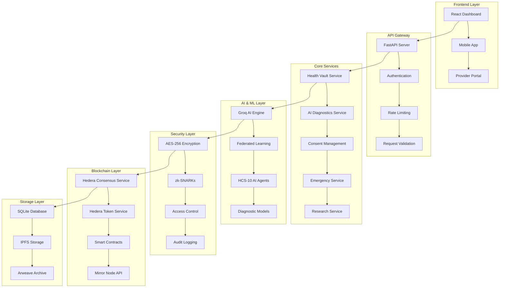
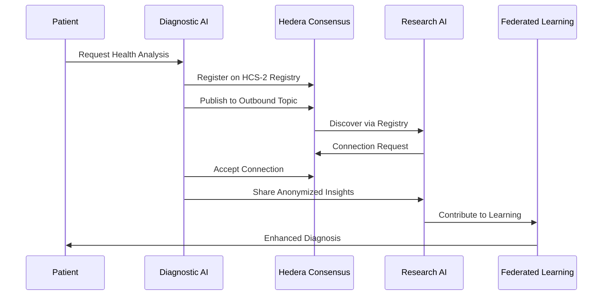

# 🏥 MediLedger Nexus

[](https://opensource.org/licenses/MIT)
[](https://www.python.org/downloads/)
[](https://fastapi.tiangolo.com/)
[](https://hedera.com/)
[](https://groq.com/)
[](https://pytest.org/)

> **Revolutionizing Healthcare Through Decentralized AI and Blockchain Technology**

MediLedger Nexus is a cutting-edge decentralized health data ecosystem built on Hedera Hashgraph, featuring zero-knowledge health vaults, AI-powered diagnostics, and a tokenized consent economy. Experience the future of healthcare where patients control their data, AI agents collaborate securely, and medical insights are generated through privacy-preserving federated learning.

---

## 🌟 Key Features

### 🔐 **Zero-Knowledge Health Vaults**
- **End-to-End Encryption**: AES-256 + RSA hybrid encryption
- **zk-SNARKs Privacy**: Prove data validity without revealing content
- **Granular Access Control**: Fine-tuned permissions for different data types
- **Immutable Audit Trail**: Every access logged on Hedera Consensus Service

### 💰 **Tokenized Consent Economy**
- **$HEAL Token Rewards**: Earn tokens for data sharing consent
- **Smart Contract Automation**: Automated compensation distribution
- **Dynamic Pricing**: Market-driven data valuation
- **Transparent Governance**: Community-driven protocol decisions

### 🤖 **AI Diagnostic Co-Pilot**
- **Ultra-Fast Inference**: Powered by Groq AI for millisecond responses
- **HCS-10 OpenConvAI**: AI agents communicate via Hedera Consensus Service
- **Federated Learning**: Collaborative AI training without data sharing
- **Multi-Modal Analysis**: Text, imaging, genomics, and sensor data

### 🚨 **Emergency Response Protocol**
- **Instant Access**: Critical health data available in emergencies
- **Smart Triage**: AI-powered emergency severity assessment
- **Global Interoperability**: HL7 FHIR standard compliance
- **Automated Notifications**: Real-time alerts to emergency contacts

### 🌍 **Global Health Interoperability**
- **HL7 FHIR Integration**: Seamless healthcare system integration
- **Cross-Border Data Exchange**: Secure international health records
- **Multi-Language Support**: Global accessibility
- **Regulatory Compliance**: HIPAA, GDPR, and regional standards

---

## 🏗️ Enterprise-Grade Architecture



### 🔄 **HCS-10 OpenConvAI Integration**



---

## 🚀 Modern Tech Stack

| Category | Technology | Purpose |
|----------|------------|---------|
| **Backend** | FastAPI 0.104+ | High-performance async API framework |
| **AI Engine** | Groq AI | Ultra-fast LLM inference (1000+ tokens/sec) |
| **Blockchain** | Hedera Hashgraph | Consensus, tokens, and smart contracts |
| **Database** | SQLite + aiosqlite | Lightweight, async-compatible database |
| **Encryption** | AES-256 + RSA-2048 | Military-grade data protection |
| **Privacy** | zk-SNARKs | Zero-knowledge proof system |
| **ML Framework** | PyTorch | Federated learning and model training |
| **Storage** | IPFS + Arweave | Decentralized and permanent storage |
| **Testing** | pytest + httpx | Comprehensive test coverage |
| **Standards** | HL7 FHIR + HCS-10 | Healthcare and AI interoperability |

---

## ⚡ Quick Start

### Prerequisites
- Python 3.11+
- Node.js 18+ (for frontend)
- Git

### 1. Clone Repository
```bash
git clone https://github.com/your-org/mediledger-nexus.git
cd mediledger-nexus/backend
```

### 2. Setup Virtual Environment
```bash
python -m venv venv
source venv/bin/activate  # On Windows: venv\Scripts\activate
```

### 3. Install Dependencies
```bash
pip install -r requirements.txt
# or
pip install -e .
```

### 4. Configure Environment
```bash
cp .env.example .env
# Edit .env with your API keys and configuration
```

### 5. Initialize Database
```bash
python -m alembic upgrade head
```

### 6. Start Development Server
```bash
uvicorn src.mediledger_nexus.main:app --reload --host 0.0.0.0 --port 8000
```

### 7. Run API Demo
```bash
python api_demo.py
```

🎉 **Success!** Your MediLedger Nexus backend is now running at `http://localhost:8000`

---

## 🧪 Testing

### Run All Tests
```bash
pytest
```

### Run with Coverage
```bash
pytest --cov=src/mediledger_nexus --cov-report=html
```

### Run Integration Tests
```bash
pytest tests/integration/ -v
```

### Run Specific Test Categories
```bash
# Unit tests only
pytest tests/unit/ -v

# AI service tests
pytest tests/unit/test_ai_services.py -v

# Blockchain integration tests
pytest tests/integration/test_hedera.py -v
```

---

## 📚 API Documentation

### Interactive API Docs
- **Swagger UI**: http://localhost:8000/docs
- **ReDoc**: http://localhost:8000/redoc

### Core Endpoints

#### 🔐 Authentication
```http
POST /api/v1/auth/register    # User registration
POST /api/v1/auth/token       # Login & get JWT token
GET  /api/v1/auth/me          # Get current user
POST /api/v1/auth/refresh     # Refresh JWT token
```

#### 🏥 Health Vault Management
```http
POST /api/v1/vault/create           # Create health vault
GET  /api/v1/vault/                 # Get user vaults
GET  /api/v1/vault/{vault_id}       # Get specific vault
PUT  /api/v1/vault/{vault_id}       # Update vault
POST /api/v1/vault/{vault_id}/upload # Upload medical record
```

#### 🤖 AI Diagnostics & HCS-10
```http
POST /api/v1/ai/register-agent      # Register AI agent
POST /api/v1/ai/diagnose           # Request AI diagnosis
GET  /api/v1/ai/insights           # Get health insights
POST /api/v1/ai/federated-learning/join # Join FL study
POST /api/v1/ai/connect/{agent_id} # Connect to AI agent
```

#### 📋 Consent Management
```http
POST /api/v1/consent/grant         # Grant data access consent
GET  /api/v1/consent/              # Get user consents
PUT  /api/v1/consent/{consent_id}  # Update consent
DELETE /api/v1/consent/{consent_id} # Revoke consent
```

#### 🚨 Emergency Access
```http
POST /api/v1/emergency/access      # Emergency data access
GET  /api/v1/emergency/profile     # Get emergency profile
PUT  /api/v1/emergency/profile     # Update emergency profile
```

---

## 🛠️ Development Guidelines

### Code Style
- **Formatter**: Black with 88-character line length
- **Linter**: Ruff for fast Python linting
- **Type Hints**: Mandatory for all functions
- **Docstrings**: Google-style documentation

### Git Workflow
```bash
# Create feature branch
git checkout -b feature/your-feature-name

# Make changes and commit
git add .
git commit -m "feat: add new health vault encryption"

# Push and create PR
git push origin feature/your-feature-name
```

### Environment Variables
```bash
# Database
DATABASE_URL=sqlite+aiosqlite:///./mediledger.db

# Hedera Configuration
HEDERA_NETWORK=testnet
HEDERA_ACCOUNT_ID=0.0.123456
HEDERA_PRIVATE_KEY=your_private_key

# AI Configuration
GROQ_API_KEY=your_groq_api_key
GROQ_MODEL=llama3-70b-8192

# Security
SECRET_KEY=your_secret_key
ENCRYPTION_KEY=your_encryption_key
```

---

## 🚀 Deployment

### Docker Deployment
```bash
# Build image
docker build -t mediledger-nexus .

# Run container
docker run -p 8000:8000 --env-file .env mediledger-nexus
```

### Production Checklist
- [ ] Set strong `SECRET_KEY` and `ENCRYPTION_KEY`
- [ ] Configure production database (PostgreSQL recommended)
- [ ] Set up Hedera mainnet accounts and keys
- [ ] Configure CORS for your frontend domain
- [ ] Set up monitoring and logging
- [ ] Enable HTTPS/TLS encryption
- [ ] Configure backup strategies
- [ ] Set up CI/CD pipelines

---

## 🔒 Security Considerations

### Data Protection
- **Encryption at Rest**: All sensitive data encrypted with AES-256
- **Encryption in Transit**: TLS 1.3 for all communications
- **Key Management**: Hardware Security Modules (HSM) recommended
- **Access Logging**: Comprehensive audit trails on Hedera

### Privacy Compliance
- **HIPAA Compliance**: Healthcare data protection standards
- **GDPR Compliance**: European data protection regulations
- **Zero-Knowledge**: Prove data validity without revealing content
- **Data Minimization**: Collect only necessary information

### Blockchain Security
- **Hedera Consensus**: Byzantine fault-tolerant consensus
- **Smart Contract Audits**: Regular security assessments
- **Multi-Signature**: Required for critical operations
- **Rate Limiting**: Protection against abuse

---

## 🤝 Contributing

We welcome contributions! Please see our [Contributing Guide](CONTRIBUTING.md) for details.

### Development Setup
1. Fork the repository
2. Create a feature branch
3. Make your changes
4. Add tests for new functionality
5. Run the test suite
6. Submit a pull request

### Reporting Issues
- Use GitHub Issues for bug reports
- Include detailed reproduction steps
- Provide environment information
- Add relevant logs and error messages

---

## 📄 License

This project is licensed under the MIT License - see the [LICENSE](LICENSE) file for details.

---

## 🙏 Acknowledgments

- **Hedera Hashgraph** - For the revolutionary DLT platform
- **Groq** - For ultra-fast AI inference capabilities
- **FastAPI** - For the excellent async web framework
- **OpenAI** - For advancing AI research and development
- **Healthcare Community** - For inspiring this project

---

## 📞 Support & Contact

- **Documentation**: [docs.mediledger-nexus.com](https://docs.mediledger-nexus.com)
- **Discord**: [Join our community](https://discord.gg/mediledger-nexus)
- **Email**: support@mediledger-nexus.com
- **Twitter**: [@MediLedgerNexus](https://twitter.com/MediLedgerNexus)

---

<div align="center">

**Built with ❤️ for the future of healthcare**

[🌟 Star us on GitHub](https://github.com/your-org/mediledger-nexus) | [🐦 Follow on Twitter](https://twitter.com/MediLedgerNexus) | [💬 Join Discord](https://discord.gg/mediledger-nexus)

</div>
